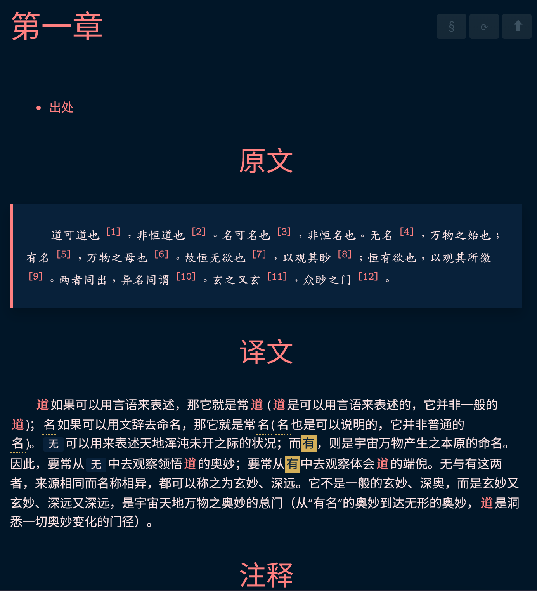
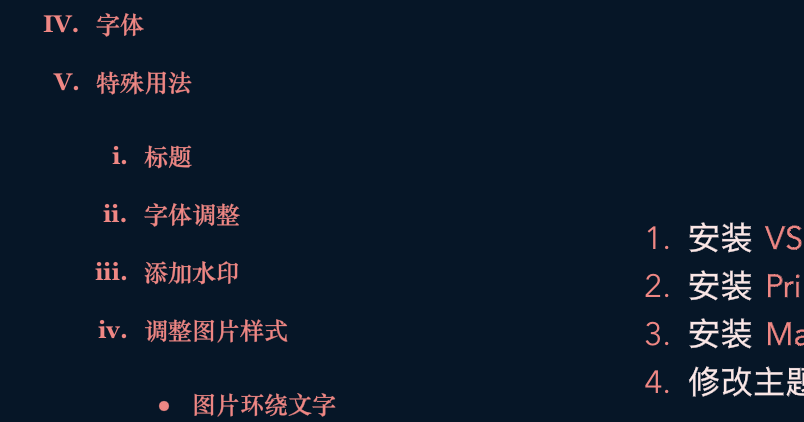
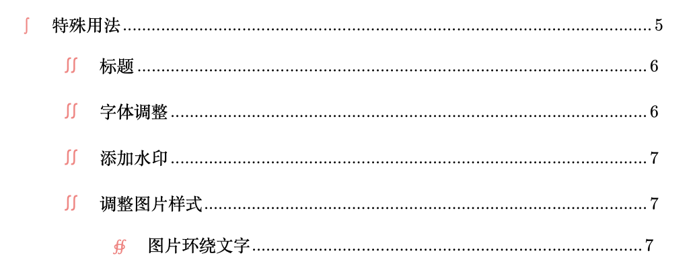
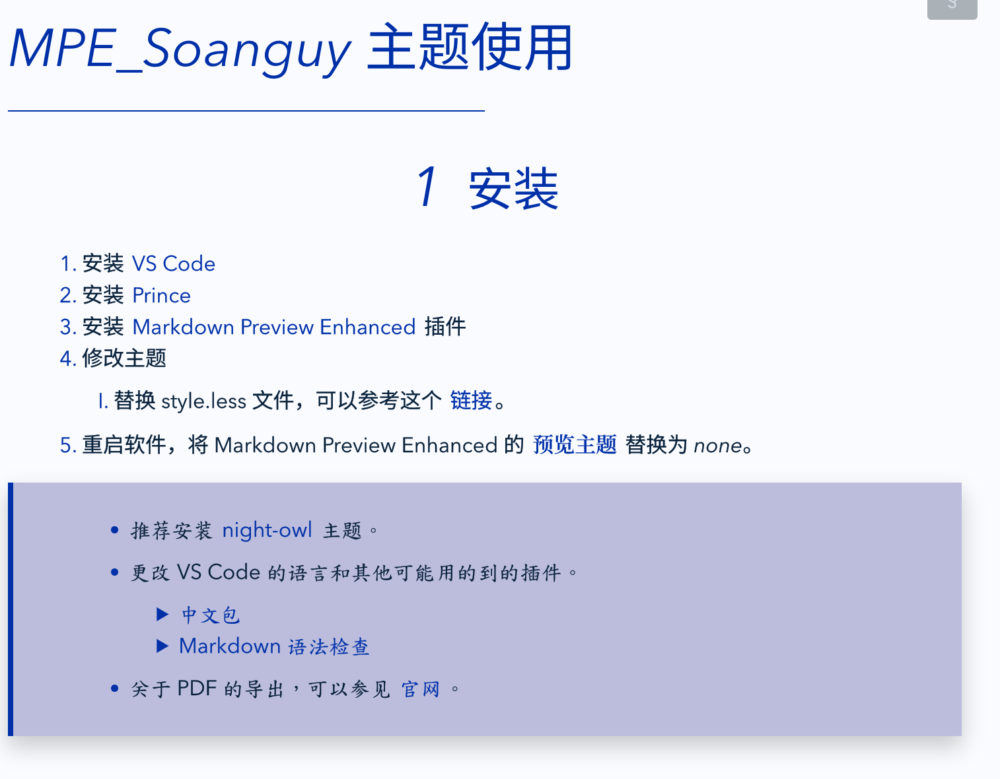

<!-- @import "[TOC]" {cmd="toc" depthFrom=2 depthTo=4 orderedList=false} -->
<div class="toc">
<h2>目录 Contents</h2>
<!-- code_chunk_output -->

- [安装](#install)
- [预览](#preview)
- [差异](#contrast)
- [更新](#update)
- [字体](#fonts)
- [特殊用法](#special-usages)
  - [插入目录](#toc-insert)
  - [标题](#about-title)
  - [字体调整](#about-fonts)
  - [添加水印](#watermark)
  - [调整图片样式](#picture-adjust)
    - [图片环绕文字](#float)
  - [页面调整](#page-adjust)
  - [列表](#about-list)
  - [代码](#about-code)
  - [表格](#about-table)
  - [mermaid](#mermaid)
  - [admontion](#admontion)
  - [其他说明](#others)
- [origin text](#origin-text)
- [translation](#translation)
- [annotation](#annotation)

<!-- /code_chunk_output -->

</div>

# <i>MPE_Soanguy</i> 主题使用

## 安装 {#install}

1. 安装 [VS Code][]
1. 安装 [Prince][]
1. 安装 [Markdown Preview Enhanced][] 插件
1. 修改主题
   1. 替换 style.less 文件，可以参考这个 [链接][]。
1. 重启软件，将 Markdown Preview Enhanced 的 **预览主题** 替换为 <i>none</i>。

> + 推荐安装 [night-owl][] 主题。
>
> + 更改 VS Code 的语言和其他可能用的到的插件。
>
>   + [中文包][]
>   + [Markdown 语法检查][]
>
> + 关于 PDF 的导出，可以参见 [官网][]。

## 预览 {#preview}

<div class="col2">

> ##### 屏显预览
>
>> 

> ##### 打印预览
>
>> 

</div>

> ⚠️请注意：本主题并未针对导出为 图片 格式做任何优化。
>
> ⚠️请注意：本主题主要在 macOS 系统上进行的测试。在 Windows 系统上可能会有些许显示差异。具体差异见 [差异](#contrast)。

## 差异 {#contrast}

<var>1. 为什么我安装主题后，看起来会有点模糊？</var>

Windows 系统的字体渲染和 macOS 系统的字体渲染有些许不同，在 macOS 上看起来很清晰的字体，可能在 Windows 上不会那么的清晰。如果能很清晰的看出有叠影，可以尝试注释掉下方的代码：

```css {.line-numbers}
  -webkit-font-smoothing: "auto";
  -webkit-text-stroke-width: calc(calc(40px - 1em) / 170);
```

<var>2. 为什么我为图片设定了浮动和缩小，但却没有任何反应呢？</var>

目前这个问题的出现应该是 MPE 插件的问题。在 macOS 上为图片设定 `alt` 属性可以正常的被渲染出来。但是在 Windows 上设定的 `alt` 属性似乎都会被省略。可以尝试修改代码中的 `alt` 为 `title`。例如：

```css {.line-numbers}
&[alt~="shadow"] --> &[title~="shadow"]
```

同时，请使用下面的语法来控制图片的显示：

``

<var>3. 我是用的是 Linux 系统，这个主题会兼容吗？</var>

如果正在使用的是 Linux 系统，例如：Ubuntu、OpenSUSE 等。基本上不会有太多的显示问题。基本上所有系统唯一有区别的地方就在于字体。在 Deepin 20.5 上经过测试发现：导出为 PDF 时，因为系统缺失 **楷体、仿宋** 等字体而导致无法正常显示文字。解决办法也很简单，只要安装必要的字体即可。

<var>4. 为什么我在 Edge、Chrome 等浏览器上可以正常显示楷体、仿宋等字体，但是在 Safari 上的显示情况却不尽人意呢？</var>

Safari 浏览器自某个版本之后，就以安全为名，禁止调用本地字体显示。如果要预览文件或者其他情形，请不要使用 Safari。

## 更新 {#update}

+ 2022.05.02
  - 调整了**代码**的字体显示不正常的问题。将代码的中文字体更改为**楷体**。
  - 修复了不显示页眉页脚的问题 <span class="fn">⚠️注意：当您发现无法正常显示页眉页脚时，请查看`@page:left`和`@page:right`中间是否有**空格**。如果存在空格，请用文本编辑器将其清除后，再重新生成 pdf。</span>。
+ 2022.05.03
  - 图片可以浮动于文字周围
  - 标题可以自动编号（二级到四级标题）
+ 2022.05.04
  - 支持 <i>STIX MATH、emoji</i> 字体
+ 2022.05.05
  - 支持目录页
  - 支持相互引用<span class="fn">关于相互引用的用法可以参见 [PrinceXML][]</span>

## 字体 {#fonts}

默认使用了如下字体：

+ 英文字体
  + Avenir Next
  + Latin Modern Roman
  + Latin Modern Mono
+ 中文字体
  + Source Han Sans SC
  + Source Han Serif SC
  + 江城圆体
  + TH-Khaai-PP0
  + HYFangSongS
  + FZLiBian-S02
+ 日文字体
  + Kozuka Gothic Pr6N
  + Kozuka Mincho Pr6N
  + A-OTF Kyoukasho ICA Pro
  + A-OTF Jomin Std
  + A-OTF Likurei Std

> ⚠️ 上述字体不下载也可以正常显示，此时会调用系统的宋体和黑体来显示。其他的如：楷体、仿宋、隶书、圆体等都会显示为宋体或黑体。下面是各操作系统缺省情况下显示的字体：
>
> + 如果您使用的是 Windows 系统，可以不需要额外安装字体。此时，默认的字体分别为：中易宋体、黑体、楷体、仿宋；日文的默认字体为：YuMincho、YuGothic、YuKyokasho。如果正常显示 圆体、隶书体等，请下载专门的字体，并在 less 文件中声明。
> + 如果您使用的是 macOS 系统，可以不需要额外安装字体。此时默认的字体分别为：苹方字体、华文字体。日文字体的显示同 Windows。
> + 如果您使用的是 Ubuntu、Opensuse、ArchLinux 等常见的操作系统，也可以不需要额外安装字体。此时默认显示的多为：文鼎字体和 noto 字体。但部分操作系统可能并未预装中文写作环境所需要的楷体、仿宋等字体。请自行安装。

> 可以通过这个链接 [font][] 下载所需字体。大概有 290M。
>
> 阿里云盘目前并不不支持分享 ttf 格式的思源字体。但可以通过这个链接下载 (otc 格式，Windows 系统可能无法使用。也可自行搜索下载。)：[思源黑体][],[思源宋体][]。

## 特殊用法 {#special-usages}

> [Markdown Preview Enhanced 插件使用说明][]

### 插入目录 {#toc-insert}

可以通过插件 [Markdown Preview Enhanced][] 或者 [Markdown TOC][] 来快速的插入目录。

如果想要将目录正常显示在打印页面中，可以将目录包裹在下列代码之中。

```html {.line-numbers}
<div class="toc">
<h2>table of contents</h2>

目录所在

</div>
```

+ 目录的预览。主题目前设定的目录在网页（宽度大于 1200px）中和在打印中显示的样式是不同的。当宽度小于 1200px 时默认不对目录进行处理。

<div class="col2">

> ##### 屏显样式
>
> 

> ##### 打印样式
>
> 

</div><div class="col2">

> ##### 其他样式
>
> 

</div>

### 标题 {#about-title}

> 五级标题和六级标题并不推荐使用，因此并未对这两级标题设定不同的样式。但是可以试试在**引用**下使用不同级别的标题。例如：
>
> ##### 这是一个五级标题
>
> ###### 这是一个六级标题

### 字体调整 {#about-fonts}

使用部分 html 标签可以达到特殊效果。如：修改字体、颜色等。具体见 [其他说明](#others)<span class="fn"><a class="pageref" href="#others"></a></span>

> 当然，也可以使用 Latex 语法来更改字体样式。例如：
>
> + $\color{blue}{RED}$
> + $\huge{SMALL}$
> + $\small\color{red}{HUGE}$

!!! question <span style="font-family:var(--font-kai-cn)">我想要使用斜体，可是我使用了`_ _`和`* *`之后，却发现字体并没有发生太大的变化，这是为什么？</span>
    在这个主题里面，默认下的`_ _`和`* *`会将字体从**中文**字体变换为**日文**字体。例如：

    - 这是默认下的日文字体：あいうえお。
    - 这是强调下的日文字体：_あいうえお_。

    那么，我该如何使用斜体呢？

    可以通过为文字添加`<i></i>`标签来让文字倾斜。例如：

    - 这是默认下的中文字体：这是没有添加 i 标签的中文。
    - 这是斜体下的中文字体：<i>这是添加了 i 标签的中文</i>。

### 添加水印 {#watermark}

找到 style.less 文件，修改下方的`商无辛`为自己想要的水印即可。`color`、`font-size`等也可以按照需要修改。

```css{.line-numbers}
@prince-overlay {
    color: rgba(0, 0, 0, 0.015);
    content: "商无辛";
    font-size: 10pt;
    font-family: var(--font-hei-cn);
    vertical-align: top;
}
```

### 调整图片样式 {#picture-adjust}

+ 
+ 
+ 
+ 

#### 图片环绕文字 {#float}

如果想要让图片浮动于文字的左右侧，可以添加`left`或者`right`来实现。请注意，在使用浮动时，请同时调整图片大小。另外，也可以通过主动添加多个换行`<br />`来实现某些效果。例如：


这是一段测试文字。道可道也 [^①]，非恒道也 [^②]。名可名也 [^③]，非恒名也。无名 [^④]，万物之始也；有名 [^⑤]，万物之母也 [^⑥]。故恒无欲也 [^⑦]，以观其眇 [^⑧]；恒有欲也，以观其所徼 [^⑨]。两者同出，异名同谓 [^⑩]。玄之又玄 [^⑾]，众眇之门 [^⑿]。<br /><br />


这是一段测试文字。道可道也 [^①]，非恒道也 [^②]。名可名也 [^③]，非恒名也。无名 [^④]，万物之始也；有名 [^⑤]，万物之母也 [^⑥]。故恒无欲也 [^⑦]，以观其眇 [^⑧]；恒有欲也，以观其所徼 [^⑨]。两者同出，异名同谓 [^⑩]。玄之又玄 [^⑾]，众眇之门 [^⑿]。

### 页面调整 {#page-adjust}

1. 调整页面大小。找到这行代码，按照需要修改即可。

    ```css{.line-numbers}
    //通过 size 来控制打印大小，可选值为任意的尺寸组合或者固定的页面尺寸。例如，size:8in 11in(width*height);size:a4 landscape;size:a4 portrait
    ```

1. 调整页眉页脚。修改第 1139 行到 1193 行的代码即可。（以`@page:right`和`@page:left`开头）
1. 调整脚注。找到`.fn {`并修改其中的代码即可。
1. 为适合打印输出，默认设置所有的一级标题前都会有换页符，即在新的一页上重新开始，且全部居于**左侧**。如果不需要的话，可以删去 `h1`下的这段代码：`break-before: right`。

### 列表 {#about-list}

为列表提供了显示和打印两种样式。

+ 无序列表
+ 充分等等
  + 无序列表的递进
  + 仍然会无序列表
    - 充分等等

1. 有序列表
1. 日日日动词
   1. 有序列表下的递进
   1. 顶顶顶方法
      1. 有序列表下的递进
      1. 顶顶顶方法

### 代码 {#about-code}

```html
<!-- 这是一段注释 -->
<html>
 <head>
        <titile>this is a html file</titile>
    </head>
    <body>
        <div id="head title">
            <p>
                <span class="para highlight">highlight paragraph</span>
            </p>
             <p>
                <span class="para highlight">高亮段落</span>
            </p>
            
        </div>
    </body>
```

```css{.line-numbers}
html{
    color:white;
    width:2px;
}
```

### 表格 {#about-table}

| 左对齐   |   右对齐 | 居中对齐 |
| :------- | -------: | :------: |
| 单元格   |   单元格 |  单元格  |
| 单元格 1 | 单元格 2 | 单元格 3 |

### mermaid

Markdown Preview Enhanced 无法将 mermaid 导出为 PDF。作为替代，可以使用 dotted 来制图。

> 请忽视图片的配色，只为演示。

```dot
digraph demo {
    label="示例"
    color="pink"
    bgcolor="white"
    fontsize="12pt"
    rankdir="TB"
    

    node[fontname="思源宋体",color="#dfdfdf",fontcolor="red"]

    father[label="爸爸", shape="box" , fillcolor=black,style=filled,fontcolor=white]
    mother[label="妈妈", shape="box", style=dashed]
    brother[label="哥哥", shape="circle",style=bold]
    sister[label="姐姐", shape="circle"]
    node[color="#FF6347"]
    strangers[label="路人",style=dotted]

    edge[fontname="思源黑体",color="blue",fontcolor="blue"]

    father->mother[label="夫妻", dir="both"]
    father->brother[label="父子"]
    father->sister[label="父子"]
    father->我 [label="父子"]

    mother->{brother,sister, 我}[label="母子"]

    {rank=same; father, mother}
    {rank=same; brother,sister, 我}
}
```

### admontion

!!! info

    测试内容

!!! warning ""

    没有标题的测试内容

!!! warning 标题测试

    有标题的测试内内容

### 其他说明 {#others}

1. 如何添加脚注：使用 `<span class="fn"></span>` 包裹脚注内容即可。
1. 如何快速分页：使用 `<hr class="pb">`。
1. 如何大面积使用楷体：`<div class="intro"></div>`。
1. 添加标签：<kbd>kbd 标签 臣本布衣</kbd>
1. 修改字体：
   1. 中文<tt>tt 标签 臣本布衣あいうえお</tt>
   1. 日文<em><tt>tt 标签 臣本布衣あいうえお</tt></em>
   1. 中文<samp>samp 标签 臣本布衣</samp>
   1. 日文<em><samp>samp 标签 臣本布衣</samp></em>
   1. <ruby>ruby 标签 臣本布衣<ruby>
1. 其他的具有语义的标签：

    - <ins>ins 臣本布衣，用于公式</ins>
    - <var>var 臣本布衣，用于警示</var>
    - <dfn>dfn 臣本布衣，用于例题</dfn>
1. pdf 导出可以选择 puppeter。通过 front-matter 来设定一些样式：

  ```{.line-numbers}
  ---
  puppeteer:
    landscape: true
    format: "A4"
    printBackground: true
  ---
  ```

[VS Code]:https://code.visualstudio.com/Download
[Prince]:https://www.princexml.com/download/
[Markdown Preview Enhanced]:https://marketplace.visualstudio.com/items?itemName=shd101wyy.markdown-preview-enhanced
[链接]:https://shd101wyy.github.io/markdown-preview-enhanced/#/zh-cn/customize-css
[night-owl]:https://marketplace.visualstudio.com/items?itemName=sdras.night-owl
[中文包]:https://marketplace.visualstudio.com/items?itemName=MS-CEINTL.vscode-language-pack-zh-hans
[Markdown 语法检查]:https://marketplace.visualstudio.com/items?itemName=DavidAnson.vscode-markdownlint
[官网]:https://shd101wyy.github.io/markdown-preview-enhanced/#/zh-cn/
[font]:https://www.aliyundrive.com/s/YZ7YJkxGgmk
[思源黑体]:https://mirrors.tuna.tsinghua.edu.cn/adobe-fonts/source-han-sans/OTC/
[思源宋体]:https://mirrors.tuna.tsinghua.edu.cn/adobe-fonts/source-han-serif/OTC/
[PrinceXML]:https://www.princexml.com/doc/gen-content/#using-target-counter
[Markdown TOC]:https://marketplace.visualstudio.com/items?itemName=joffreykern.markdown-toc
[Markdown Preview Enhanced 插件使用说明]:https://shd101wyy.github.io/markdown-preview-enhanced/#/zh-cn/

# 第一章 {#chapter-1}

+ [出处](https://www.daodejing.org/1.html)

## origin text

> 道可道 <span class="fn">第一个**道**是名词，指的是宇宙的本原和实质，引申为原理、原则、真理、规律等。第二个**道**是动词。指解说、表述的意思，犹言“说得出”。</span>也 [^①]，非恒<span class="fn">恒：一般的，普通的。</span>道也 [^②]。名可名也 [^③]，非恒名也。无名 [^④]，万物之始也；有名 [^⑤]，万物之母也 [^⑥]。故恒无欲也 [^⑦]，以观其眇 [^⑧]；恒有欲也，以观其所徼 [^⑨]。两者同出，异名同谓 [^⑩]。玄之又玄 [^⑾]，众眇之门 [^⑿]。

## translation

**道**如果可以用言语来表述，那它就是常**道** (**道**是可以用言语来表述的，它并非一般的**道**)；<u>名</u>如果可以用文辞去命名，那它就是常<u>名</u>(<u>名</u>也是可以说明的，它并非普通的<u>名</u>)。`无`可以用来表述天地浑沌未开之际的状况；而==有==，则是宇宙万物产生之本原的命名。因此，要常从`无`中去观察领悟**道**的奥妙；要常从==有==中去观察体会**道**的端倪。无与有这两者，来源相同而名称相异，都可以称之为玄妙、深远。它不是一般的玄妙、深奥，而是玄妙又玄妙、深远又深远，是宇宙天地万物之奥妙的总门（从“有名”的奥妙到达无形的奥妙，**道**是洞悉一切奥妙变化的门径）。

## annotation

注意：使用 markdown 的脚注，所有的脚注都将出现在最后。但这个不是<span class="fn">这是使用`<span class="fn"></span>`产生的。</span>。

[^①]: 第一个**道**是名词，指的是宇宙的本原和实质，引申为原理、原则、真理、规律等。第二个**道**是动词。指解说、表述的意思，犹言“说得出”。
[^②]: 恒：一般的，普通的。
[^③]: 第一个<u>名</u>是名词，指**道**的形态。第二个<u>名</u>是动词，说明的意思。
[^④]: 无名：指无形。
[^⑤]: 有名：指有形。
[^⑥]: 母：母体，根源。
[^⑦]: 恒：经常。
[^⑧]: <ruby>眇<rt>miǎo</rt></ruby>：通妙，微妙的意思。
[^⑨]: <ruby>徼<rt>jiǎo</rt></ruby>：边际、边界。引申端倪的意思。
[^⑩]: 谓：称谓。此为“指称”。
[^⑾]: 玄：深黑色，玄妙深远的含义。
[^⑿]: 门：之门，一切奥妙变化的总门径，此用来比喻宇宙万物的唯一原**道**的门径。

<details>
  <summary>Title of Contents</summary>

contents contents **contents** contents

+ contents contents

> contents contents **contents** contents
>
> + contents contents
>   + contents contents
  
</details>
